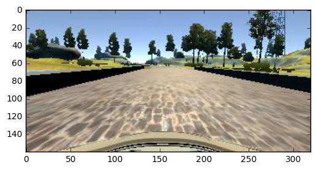

# Behavioural Cloning - Project 3

## 1. Objective

In this project, the goal is to teach a car using deep learning to mimic the behaviour of a human in a simulator. The neural network has to predict the correct steering angle that the car has to perform using the input camera images that it receives.

This project report is divided in 3 sections:
* Data preprocessing
* Model architecture
* Training, testing and model performance

## 2. Data Preprocessing

Before being passed to the neural network, some processing of the data was done and is explained below.

The input file driving_log.csv is read using pandas. An image is then randomly selected between the center, the left and right image for training. The steering angle is adjusted depending on the image obtained to simulate the car going off the course and requiring to re-adjust itself by steering harder to a certain direction.

The input image is resized with OpenCV to obtain an image shape of 64 x 64 x 3, which makes computation simpler and easier than the full complete image. Addionally, the top part of 1/5th and bottom 25 pixels are cropped off to remove the sky and the hood of the car that do not contribute to the understanding of the autonomous driving.

The resized and cropped image can be seen next to the original image here:


Original Image


Cropped and resized image


A lambda layer was added as the first layer of the neural network to scale the data to have values between -0.5 and 0.5.

### 2.1 Data augmentation

To avoid having to gather data in many different conditions and to train over many hours, data augmentation is used to obtain more varied training data. The data is also generated on the fly using a generator so that the data is not all stored on disk.

The first data augmentation technique we used is to adjust the brightness of the training images to simulate different lighting conditions that the car could see.

The second data augmentation used is a horizontal and vertical image translation as if the car was driving in different parts of the road.

Finally, another augmentation trick used is to flip the image vertically and to invert the steering angle to obtain more turns to the right side, since the original track mostly has left curves.

The generator and preprocessing code can be seen below.

```python
def preprocess(input_files):
    position = np.random.choice(['center', 'left', 'right'])#, p = [0.40, 0.10, 0.50])
    idx = np.random.randint(len(input_files))
    image_path = input_file[position][idx]
    if position == 'left':
        shift_angle = 0.25
    elif position == 'right':
        shift_angle = -0.25
    else:
        shift_angle = 0.

    image = load_image(image_path)
    steer_angle = input_file['steering'][idx] + shift_angle        

    image = augment_brightness(image)
    image, steer_angle = augment_trans_shifts(image, steer_angle, 70)
        image = resize_image(image)

    if np.random.randint(2) == 0:
        image = cv2.flip(image, 1)
        steer_angle = -steer_angle

    return image, steer_angle

def generate_data(input_file, batch_size=32):
    img_rows, img_cols, ch = 64, 64, 3
    features = np.zeros((batch_size, img_rows, img_cols, ch))
    label = np.zeros(batch_size)
    while True:
        for i in range(batch_size):
            X, y = preprocess(input_file)
            X = X.reshape(1, img_rows, img_cols, 3)
            features[i] = X
            label[i] = y
        yield features, label
```

## 3. Model architecture

The neural network architecture used is derived from Nvidia's model, which can be seen in the figure below.


The compiled model generates the following summary:

    ____________________________________________________________________________________________________
    Layer (type)                     Output Shape          Param #     Connected to                     
    ====================================================================================================
    maxpooling2d_3 (MaxPooling2D)    (None, 32, 32, 3)     0           maxpooling2d_input_3[0][0]       
    ____________________________________________________________________________________________________
    lambda_3 (Lambda)                (None, 32, 32, 3)     0           maxpooling2d_3[0][0]             
    ____________________________________________________________________________________________________
    convolution2d_11 (Convolution2D) (None, 32, 32, 24)    1824        lambda_3[0][0]                   
    ____________________________________________________________________________________________________
    activation_17 (Activation)       (None, 32, 32, 24)    0           convolution2d_11[0][0]           
    ____________________________________________________________________________________________________
    convolution2d_12 (Convolution2D) (None, 32, 32, 36)    21636       activation_17[0][0]              
    ____________________________________________________________________________________________________
    activation_18 (Activation)       (None, 32, 32, 36)    0           convolution2d_12[0][0]           
    ____________________________________________________________________________________________________
    convolution2d_13 (Convolution2D) (None, 32, 32, 48)    43248       activation_18[0][0]              
    ____________________________________________________________________________________________________
    activation_19 (Activation)       (None, 32, 32, 48)    0           convolution2d_13[0][0]           
    ____________________________________________________________________________________________________
    convolution2d_14 (Convolution2D) (None, 32, 32, 64)    27712       activation_19[0][0]              
    ____________________________________________________________________________________________________
    activation_20 (Activation)       (None, 32, 32, 64)    0           convolution2d_14[0][0]           
    ____________________________________________________________________________________________________
    convolution2d_15 (Convolution2D) (None, 32, 32, 64)    36928       activation_20[0][0]              
    ____________________________________________________________________________________________________
    activation_21 (Activation)       (None, 32, 32, 64)    0           convolution2d_15[0][0]           
    ____________________________________________________________________________________________________
    flatten_3 (Flatten)              (None, 65536)         0           activation_21[0][0]              
    ____________________________________________________________________________________________________
    dropout_1 (Dropout)              (None, 65536)         0           flatten_3[0][0]                  
    ____________________________________________________________________________________________________
    dense_9 (Dense)                  (None, 100)           6553700     dropout_1[0][0]                  
    ____________________________________________________________________________________________________
    activation_22 (Activation)       (None, 100)           0           dense_9[0][0]                    
    ____________________________________________________________________________________________________
    dense_10 (Dense)                 (None, 50)            5050        activation_22[0][0]              
    ____________________________________________________________________________________________________
    activation_23 (Activation)       (None, 50)            0           dense_10[0][0]                   
    ____________________________________________________________________________________________________
    dense_11 (Dense)                 (None, 10)            510         activation_23[0][0]              
    ____________________________________________________________________________________________________
    activation_24 (Activation)       (None, 10)            0           dense_11[0][0]                   
    ____________________________________________________________________________________________________
    dropout_2 (Dropout)              (None, 10)            0           activation_24[0][0]              
    ____________________________________________________________________________________________________
    dense_12 (Dense)                 (None, 1)             11          dropout_2[0][0]                  
    ====================================================================================================
    Total params: 6690619
    ____________________________________________________________________________________________________

A modification brought to Nvidia's model is the addition of a MaxPooling layer before the first convolutional layer to reduce the dimensionality, hence the computational load.

To avoid overfitting, 2 dropout layers with probability 0.25 we're added to the model.

## 4. Training, testing and validation

The data was split using sklearn's train_test_split function to obtain training and testing data.

Keras' fit_generator was used to train the model using a generator to generate data as the model is being trained.

The Adam optimizer is used to train the model since it has been proven to be successful in the community for these tasks. To ensure that our model has seen enough data, we train on 20,000 samples per epoch and 5 epochs in total. The generator takes in batch sizes of 64 samples. A learning rate of 0.00001 was used, which performed best and did not hit plateau's.

An exerpt of the training and generator can be seen below.

```python
train_generator = generate_data(input_file, batch_size)
adam = Adam(lr=0.00001, beta_1=0.9, beta_2=0.999, epsilon=1e-08, decay=0.0)
model.compile(optimizer=adam, loss='mean_squared_error', metrics=['accuracy'])

model.fit_generator(train_generator,
                    samples_per_epoch=samples_per_epoch, nb_epoch=nb_epoch,
                    verbose=1)
```

### 4.1 Performance of the model

In both tracks, the model performs well and never deviates from the center lane (it always stays within the lines). Even though it has never seen any data in the second track, the model behaves normally and drives all the way smoothly and always remains on the drivable portion of the track. For future improvement work, the throttle could be added in one of the outputs of the model to obtain even better turns, as the model would know to slow down before a turn.
