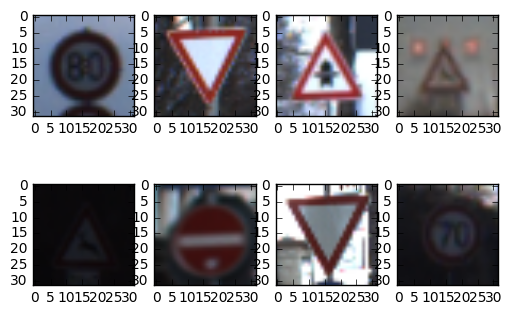
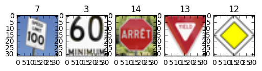
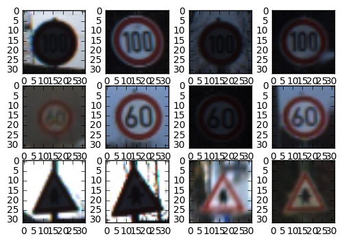
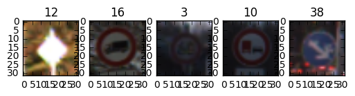

# Self-Driving Car Engineer Nanodegree

## Deep Learning

## Project: Build a Traffic Sign Recognition Classifier

---

## Step 1: Dataset Exploration


The pickled data is a dictionary with 4 key/value pairs:

- features -> the images pixel values, (width, height, channels)
- labels -> the label of the traffic sign
- sizes -> the original width and height of the image, (width, height)
- coords -> coordinates of a bounding box around the sign in the image, (x1, y1, x2, y2). Based the original image (not the resized version).


```python
# Load pickled data
import pickle
import os

training_file = "./train.p"
testing_file = "./test.p"

with open(training_file, mode='rb') as f:
    train = pickle.load(f)
with open(testing_file, mode='rb') as f:
    test = pickle.load(f)
    
X_train, y_train = train['features'], train['labels']
X_test, y_test = test['features'], test['labels']
```


```python
### To start off let's do a basic data summary.
import random
import numpy as np
keep_ratio = 1

image_shape = X_train[0].shape

train_idx = np.random.randint(0, X_train.shape[0], size=(X_train.shape[0] * keep_ratio))
n_train = int(X_train.shape[0] * keep_ratio)

test_idx = np.random.randint(0, X_test.shape[0], size=(X_test.shape[0] * keep_ratio))
n_test = int(X_test.shape[0] * keep_ratio)

X_train = X_train[train_idx]
y_train = y_train[train_idx]
X_test = X_test[test_idx]
y_test = y_test[test_idx]

n_classes = y_train.max() + 1

print("Number of training examples =", n_train)
print("Number of testing examples =", n_test)
print("Image data shape =", image_shape)
print("Number of classes =", n_classes)
```

    Number of training examples = 39209
    Number of testing examples = 12630
    Image data shape = (32, 32, 3)
    Number of classes = 43


```python
### Data exploration visualization goes here.
### Feel free to use as many code cells as needed.
import matplotlib.pyplot as plt
import random
%matplotlib inline
fig = plt.figure()

for i in range(1, 9):
    a=fig.add_subplot(2,4,i)
    idx = random.randint(0, n_train)
    plt.imshow(X_train[idx])
```





----

## Step 2: Design and Test a Model Architecture

The model is trained and tested on the [German Traffic Sign Dataset](http://benchmark.ini.rub.de/?section=gtsrb&subsection=dataset).


```python
### Preprocess the data here.
### Feel free to use as many code cells as needed.
import cv2
import numpy as np
from sklearn import preprocessing

def rgb_to_grayscale(images, flatten=0):
    """
    images: matrix of RGB images
    return: flattened grayscale images
    """
    image_shape = images.shape
    if flatten:
        return np.average(images, axis=3).reshape(image_shape[0], image_shape[1] * image_shape[2])
    else:
        return np.average(images, axis=3).reshape(image_shape[0], image_shape[1], image_shape[2], 1)
    
def normalize(images, flatten=0):
    """
    images: matrix of grayscale
    return: mean subtracted, scaled between -1 and 1
    """
    return images
    n_train = images.shape[0]
    if flatten:
        subtracted_mean = images - np.mean(images, axis=1).reshape(n_train, 1)
    else:
        subtracted_mean = images - np.mean(images)
    return subtracted_mean
    #return preprocessing.scale(images)
    #min_max_scaler = preprocessing.MinMaxScaler(feature_range=(-1,1))
    #return min_max_scaler.fit_transform(subtracted_mean)
```

### Question 1 

_Describe the techniques used to preprocess the data._

**Answer:**

I initially tried preprocessing the images by obtaining the grayscale, and to flatetenning the the images into a single color channel. Additionally, I applied min-max scaling to have the values between 0 and 1 to ensure that all features (or pixels) are treated equally, and hence improves the accuracy of the classifier.

I then decided to keep the 3 color channels, as color is important in determining the meaning of a traffic sign.

The labels use one-hot encoding since that is the input to the model, and was computed with the sklearn module.


```python
### Generate data additional (if you want to!)
### and split the data into training/validation/testing sets here.
### Feel free to use as many code cells as needed.
from sklearn.model_selection import train_test_split
from sklearn.preprocessing import LabelBinarizer
"""
X_train_gray = rgb_to_grayscale(X_train)
X_train_normalized = normalize(X_train_gray)

X_test_gray = rgb_to_grayscale(X_test)
test_features = normalize(X_test_gray)
"""

train_features = normalize(X_train)
test_features = normalize(X_test)

encoder = LabelBinarizer()
encoder.fit(y_train)
train_labels = encoder.transform(y_train)
test_labels = encoder.transform(y_test)
train_labels = train_labels.astype(np.float32)
test_labels = test_labels.astype(np.float32)

# Get randomized datasets for training and validation
train_features, valid_features, train_labels, valid_labels = train_test_split(
    train_features,
    train_labels,
    test_size=0.05,
    random_state=832289)
```


```python
import os
pickle_file = 'traffic_signs_preprocessed.pickle'
if not os.path.isfile(pickle_file):
    print('Saving data to pickle file...')
    try:
        with open(pickle_file, 'wb') as pfile:
            pickle.dump(
                {
                    'train_dataset': train_features,
                    'train_labels': train_labels,
                    'valid_dataset': valid_features,
                    'valid_labels': valid_labels,
                    'test_dataset': test_features,
                    'test_labels': test_labels,
                },
                pfile, pickle.HIGHEST_PROTOCOL)
    except Exception as e:
        print('Unable to save data to', pickle_file, ':', e)
        raise

print('Data cached in pickle file.')
```

### Question 2

_Describe how you set up the training, validation and testing data for your model. If you generated additional data, why?_

**Answer:**

The training set was divided into two groups: the training and the validation data. Using sklearn's train_test_split, I chose 5% of the total training data to be used for validation, ensuring that we aren't overfitting to the training data. The test set is kept as is.

To improve the model, fake data can be generated by manipulating the current training data and applying some iamge processing to simulate new data. Since traffic signs in the real world can be affected by different lighting conditions, obstructed and many more things, we can fake these conditions by changing the luminosity of the image, adding shadows, rotating the signs, adding noise and cropping out the images to have more data.


```python
import tensorflow as tf

tf.reset_default_graph()

def get_weight(shape):
    return tf.Variable(tf.truncated_normal(shape, stddev=0.1))

def get_bias(shape, constant=1):
    if constant != 1:
        return tf.Variable(tf.zeros(shape))
    else:
        return tf.constant(0.1, shape=shape)
    
def get_conv2d(x, W, stride):
    return tf.nn.conv2d(x, W, [1, stride, stride, 1], padding='SAME')

def get_loss(logits, y_true):
    cross_entropy = tf.nn.softmax_cross_entropy_with_logits(logits, y_true)
    #cross_entropy = tf.nn.sparse_softmax_cross_entropy_with_logits(logits, y_true)
    loss = tf.reduce_mean(cross_entropy)
    return loss

def get_maxpool2d(x, k=2):
    return tf.nn.max_pool(
        x,
        ksize=[1, k, k, 1],
        strides=[1, k, k, 1],
        padding='SAME')

def inference(images, keep_prob):
    n_features = image_shape[0] * image_shape[1]

    filter_size_width = 5
    filter_size_height = 5
    color_channels = 3
    k_output = [32, 64, 192, 256]
    learning_rate = 0.001

    # conv0 layer : 32 x 32 x 3
    with tf.name_scope('conv0'):
        W_conv0 = get_weight([filter_size_width, filter_size_height, color_channels, k_output[0]])
        b_conv0 = get_bias([k_output[0]], constant=0)
        conv0 = get_conv2d(images, W_conv0, stride=1)
        h_conv0 = tf.nn.relu(conv0 + b_conv0)
        h_conv0 = get_maxpool2d(h_conv0, k=2)

    # conv1 layer : 16 x 16 x 32
    with tf.name_scope('conv1'):
        W_conv1 = get_weight([filter_size_width, filter_size_height, k_output[0], k_output[1]])
        b_conv1 = get_bias([k_output[1]])
        conv1 = get_conv2d(h_conv0, W_conv1, stride=1)
        h_conv1 = tf.nn.relu(conv1 + b_conv1)
        h_conv1 = get_maxpool2d(h_conv1, k=2)

    # conv2 layer : 8 x 8 x 64
    with tf.name_scope('conv2'):
        W_conv2 = get_weight([filter_size_width, filter_size_height, k_output[1], k_output[2]])
        b_conv2 = get_bias([k_output[2]])
        conv2 = get_conv2d(h_conv1, W_conv2, stride=1)
        h_conv2 = tf.nn.relu(conv2 + b_conv2)
        h_conv2 = get_maxpool2d(h_conv2, k=2)


    # fc1 layer : 4 x 4 x 192
    with tf.name_scope('fc1'):    
        prev_layer_shape = h_conv2.get_shape().as_list()
        prev_dim = prev_layer_shape[1] * prev_layer_shape[2] * prev_layer_shape[3]
        W_fc1 = get_weight([prev_dim, 512])
        b_fc1 = get_bias([512])
        h_conv2_flat = tf.reshape(h_conv2, [-1, prev_dim])

        # 1 x 1 x 3072
        fc1 = tf.matmul(h_conv2_flat, W_fc1) + b_fc1
        fc1 = tf.nn.relu(fc1)

    # fc2 layer : 1 x 1 x 512
    with tf.name_scope('fc2'):
        W_fc2 = get_weight([512, 256])
        b_fc2 = get_bias([256])
        fc2 = tf.matmul(fc1, W_fc2) + b_fc2
        fc2 = tf.nn.relu(fc2)

    fc2 = tf.nn.dropout(fc2, keep_prob=keep_prob, seed=66478)
        
    # fc3 layer : 1 x 1 x 256
    with tf.name_scope('fc3'):
        W_fc3 = get_weight([256, n_classes])
        b_fc3 = get_bias([n_classes])
        fc3 = tf.matmul(fc2, W_fc3) + b_fc3

    #fc3 = tf.nn.relu(fc3)
    # 1 x 1 x 43

    # L2 regularization for the fully connected parameters.
    regularizers = (tf.nn.l2_loss(W_fc1) + tf.nn.l2_loss(b_fc1) +
                    tf.nn.l2_loss(W_fc2) + tf.nn.l2_loss(b_fc2) +
                    tf.nn.l2_loss(W_fc3) + tf.nn.l2_loss(b_fc3))
        
    return fc3, regularizers

x = tf.placeholder(tf.float32, [None, image_shape[0], image_shape[1], image_shape[2]])
y = tf.placeholder(tf.float32, [None, n_classes])
keep_prob = tf.placeholder(tf.float32)

logits, regularizers = inference(x, keep_prob)

######## testing ########
learning_rate = 0.0001

loss = get_loss(logits, y)

# Add the regularization term to the loss.
loss += 5e-4 * regularizers

with tf.name_scope('accuracy'):
    # Determine if the predictions are correct
    is_correct_prediction = tf.equal(tf.argmax(tf.nn.softmax(logits), 1), tf.argmax(y, 1))
    # Calculate the accuracy of the predictions
    accuracy = tf.reduce_mean(tf.cast(is_correct_prediction, tf.float32))
    tf.scalar_summary('accuracy', accuracy)

# Add a scalar summary for the snapshot loss.
tf.scalar_summary("loss_value", loss)
# Create a variable to track the global step.
global_step = tf.Variable(0, name='global_step', trainable=False)

#optimizer = tf.train.GradientDescentOptimizer(learning_rate=learning_rate).minimize(loss)#, global_step=global_step)
optimizer = tf.train.AdamOptimizer(5e-4).minimize(loss)

# Build the summary Tensor based on the TF collection of Summaries.
summary = tf.merge_all_summaries()

init = tf.initialize_all_variables()

# Create a saver for writing training checkpoints.
saver = tf.train.Saver()
```


```python
import time
training_epochs = 50
batch_size = 100
display_step = 1
log_batch_step = 50
dropout_keep_prob = 0.5

batches = []
loss_batch = []
train_acc_batch = []
valid_acc_batch = []

# Feed dicts for training, validation, and test session
train_feed_dict = {x: train_features, y: train_labels, keep_prob: dropout_keep_prob}
valid_feed_dict = {x: valid_features, y: valid_labels, keep_prob: 1.0}
test_feed_dict = {x: test_features, y: test_labels, keep_prob: 1.0}

log_dir = "data3"

# Instantiate a SummaryWriter to output summaries and the Graph.
with tf.Session() as sess:
    summary_writer = tf.train.SummaryWriter(log_dir, sess.graph)
    #sess.run(init)
    saver.restore(sess, "data3/checkpoint-14")
    print("Model restored.")

    total_batches = int(len(train_features)/batch_size)
    for epoch in range(training_epochs):
        start_time = time.time()
        for i in range(total_batches):
            batch_start = i * batch_size
            batch_features = train_features[batch_start:batch_start + batch_size]
            batch_labels = train_labels[batch_start:batch_start + batch_size]

            _, l = sess.run(
                [optimizer, loss], 
                feed_dict={x: batch_features, y: batch_labels, keep_prob: 0.8})

            if i % log_batch_step == 0:
                previous_batch = batches[-1] if batches else 0
                batches.append(log_batch_step + previous_batch)

                training_accuracy = sess.run(accuracy, feed_dict={x: batch_features, y: batch_labels, keep_prob: 1.0})
                validation_accuracy = sess.run(accuracy, feed_dict=valid_feed_dict)
                loss_batch.append(l)
                train_acc_batch.append(training_accuracy)
                valid_acc_batch.append(validation_accuracy)
                duration = time.time() - start_time
                print("Epoch:", '%04d' % (epoch+1),  "Step: %d" % (epoch * batch_size + i), "loss =", \
                    "{:.9f}".format(l), "Accuracy: %.7f" % (validation_accuracy),"duration = ", duration)

        summary_str = sess.run(summary, feed_dict=valid_feed_dict)
        summary_writer.add_summary(summary_str, epoch)
        summary_writer.flush()
        
        checkpoint_file = os.path.join(log_dir, 'checkpoint')
        saver.save(sess, checkpoint_file, global_step=epoch)

    # Check accuracy against Validation data
    validation_accuracy = sess.run(accuracy, feed_dict=valid_feed_dict)
    print("Validation Accuracy:", validation_accuracy)
    #test_accuracy = sess.run(accuracy, feed_dict=test_feed_dict)
    #print("Test Accuracy:", test_accuracy)
```

    Model restored.
    Epoch: 0001 Step: 0 loss = 5.079576492 Accuracy: 0.0887302 duration =  3.567056655883789
    Epoch: 0001 Step: 50 loss = 4.846253872 Accuracy: 0.0917899 duration =  28.255085229873657
    Epoch: 0001 Step: 100 loss = 5.065148354 Accuracy: 0.1019888 duration =  50.70201802253723
    Epoch: 0001 Step: 150 loss = 4.961965084 Accuracy: 0.0902601 duration =  73.13897228240967
    Epoch: 0001 Step: 200 loss = 4.806252480 Accuracy: 0.0922998 duration =  95.67501926422119
    Epoch: 0001 Step: 250 loss = 4.864131451 Accuracy: 0.0922998 duration =  121.12374114990234
    Epoch: 0001 Step: 300 loss = 5.011816025 Accuracy: 0.1065783 duration =  147.44919085502625
    Epoch: 0001 Step: 350 loss = 4.906854153 Accuracy: 0.1070882 duration =  174.32979035377502
    Epoch: 0002 Step: 100 loss = 4.981126308 Accuracy: 0.0922998 duration =  3.4870002269744873
    Epoch: 0002 Step: 150 loss = 4.787728786 Accuracy: 0.1081081 duration =  33.09755873680115
    Epoch: 0002 Step: 200 loss = 4.994364262 Accuracy: 0.1050484 duration =  59.98332595825195
    Epoch: 0002 Step: 250 loss = 4.938695908 Accuracy: 0.0922998 duration =  85.42861819267273
    Epoch: 0002 Step: 300 loss = 4.834463120 Accuracy: 0.0922998 duration =  114.21742558479309
    Epoch: 0002 Step: 350 loss = 4.759273529 Accuracy: 0.1075982 duration =  138.76487183570862
    Epoch: 0002 Step: 400 loss = 4.982498646 Accuracy: 0.0922998 duration =  161.72604537010193
    Epoch: 0002 Step: 450 loss = 4.832962513 Accuracy: 0.0922998 duration =  184.7655827999115
    Epoch: 0003 Step: 200 loss = 4.896706581 Accuracy: 0.0922998 duration =  3.0818357467651367
    Epoch: 0003 Step: 250 loss = 4.719638824 Accuracy: 0.1091280 duration =  26.003063917160034
    Epoch: 0003 Step: 300 loss = 4.937375069 Accuracy: 0.1075982 duration =  49.594069480895996
    Epoch: 0003 Step: 350 loss = 4.792956829 Accuracy: 0.0922998 duration =  72.63735318183899
    Epoch: 0003 Step: 400 loss = 4.795392036 Accuracy: 0.1361550 duration =  99.80916142463684
    Epoch: 0003 Step: 450 loss = 4.685054302 Accuracy: 0.1371749 duration =  126.23616147041321
    Epoch: 0003 Step: 500 loss = 4.871624470 Accuracy: 0.0922998 duration =  149.41568446159363
    Epoch: 0003 Step: 550 loss = 4.808990479 Accuracy: 0.0922998 duration =  173.16800355911255
    Epoch: 0004 Step: 300 loss = 4.839698315 Accuracy: 0.0928098 duration =  3.130894422531128
    Epoch: 0004 Step: 350 loss = 4.601517677 Accuracy: 0.0922998 duration =  28.223471641540527
    Epoch: 0004 Step: 400 loss = 4.866617203 Accuracy: 0.1371749 duration =  53.91040563583374
    Epoch: 0004 Step: 450 loss = 4.721396446 Accuracy: 0.0989291 duration =  78.51801109313965
    Epoch: 0004 Step: 500 loss = 4.726498127 Accuracy: 0.1004589 duration =  107.83076858520508
    Epoch: 0004 Step: 550 loss = 4.667351246 Accuracy: 0.1320755 duration =  137.35469794273376
    Epoch: 0004 Step: 600 loss = 4.772202492 Accuracy: 0.1478837 duration =  166.2303388118744
    Epoch: 0004 Step: 650 loss = 4.735337257 Accuracy: 0.1596124 duration =  192.3511257171631
    Epoch: 0005 Step: 400 loss = 4.721660137 Accuracy: 0.1534931 duration =  3.5247182846069336
    Epoch: 0005 Step: 450 loss = 4.547455788 Accuracy: 0.1769505 duration =  34.07080817222595
    Epoch: 0005 Step: 500 loss = 4.658966541 Accuracy: 0.1800102 duration =  64.8682222366333
    Epoch: 0005 Step: 550 loss = 4.599035263 Accuracy: 0.1764406 duration =  91.45624613761902
    Epoch: 0005 Step: 600 loss = 4.543141842 Accuracy: 0.1402346 duration =  116.62755393981934
    Epoch: 0005 Step: 650 loss = 4.415744781 Accuracy: 0.1861295 duration =  141.3037793636322
    Epoch: 0005 Step: 700 loss = 4.587372780 Accuracy: 0.1407445 duration =  165.36806058883667
    Epoch: 0005 Step: 750 loss = 4.591002464 Accuracy: 0.1642019 duration =  189.25742197036743
    Epoch: 0006 Step: 500 loss = 4.468558311 Accuracy: 0.1713412 duration =  3.845775842666626
    Epoch: 0006 Step: 550 loss = 4.369715691 Accuracy: 0.1876594 duration =  27.264665603637695
    Epoch: 0006 Step: 600 loss = 4.567824364 Accuracy: 0.1800102 duration =  52.72781157493591
    Epoch: 0006 Step: 650 loss = 4.573797703 Accuracy: 0.1698113 duration =  79.26702952384949
    Epoch: 0006 Step: 700 loss = 4.423402786 Accuracy: 0.1708312 duration =  102.98456931114197
    Epoch: 0006 Step: 750 loss = 4.266324520 Accuracy: 0.2243753 duration =  128.42985796928406
    Epoch: 0006 Step: 800 loss = 4.092837334 Accuracy: 0.2238654 duration =  154.71984195709229
    Epoch: 0006 Step: 850 loss = 4.112021923 Accuracy: 0.2248853 duration =  181.41904878616333
    Epoch: 0007 Step: 600 loss = 3.951111794 Accuracy: 0.2432432 duration =  3.3996548652648926
    Epoch: 0007 Step: 650 loss = 3.885693073 Accuracy: 0.2391637 duration =  32.88638710975647
    Epoch: 0007 Step: 700 loss = 3.912392378 Accuracy: 0.2447731 duration =  59.324633836746216
    Epoch: 0007 Step: 750 loss = 3.660375595 Accuracy: 0.2508924 duration =  84.49616479873657
    Epoch: 0007 Step: 800 loss = 3.840335846 Accuracy: 0.2442631 duration =  111.39340853691101
    Epoch: 0007 Step: 850 loss = 3.813494682 Accuracy: 0.2442631 duration =  139.6568500995636
    Epoch: 0007 Step: 900 loss = 3.855796814 Accuracy: 0.3391127 duration =  167.70898866653442
    Epoch: 0007 Step: 950 loss = 3.687610626 Accuracy: 0.3268740 duration =  192.11039996147156
    Epoch: 0008 Step: 700 loss = 3.688552141 Accuracy: 0.3350331 duration =  3.5014777183532715
    Epoch: 0008 Step: 750 loss = 3.312717915 Accuracy: 0.3411525 duration =  35.716830253601074
    Epoch: 0008 Step: 800 loss = 3.444113016 Accuracy: 0.3355431 duration =  62.35579872131348
    Epoch: 0008 Step: 850 loss = 3.335206032 Accuracy: 0.3416624 duration =  86.59033989906311
    Epoch: 0008 Step: 900 loss = 3.267631292 Accuracy: 0.3309536 duration =  109.26166200637817
    Epoch: 0008 Step: 950 loss = 3.220703602 Accuracy: 0.3498215 duration =  131.58094906806946
    Epoch: 0008 Step: 1000 loss = 3.348286629 Accuracy: 0.3518613 duration =  153.91879749298096
    Epoch: 0008 Step: 1050 loss = 3.243086815 Accuracy: 0.3753187 duration =  176.1319386959076
    Epoch: 0009 Step: 800 loss = 3.236062527 Accuracy: 0.3778684 duration =  2.8993542194366455
    Epoch: 0009 Step: 850 loss = 3.027968407 Accuracy: 0.4008159 duration =  25.03017783164978
    Epoch: 0009 Step: 900 loss = 3.131101131 Accuracy: 0.3814380 duration =  47.61703133583069
    Epoch: 0009 Step: 950 loss = 3.010441303 Accuracy: 0.4130546 duration =  71.03208255767822
    Epoch: 0009 Step: 1000 loss = 3.163475513 Accuracy: 0.4309026 duration =  95.35790634155273
    Epoch: 0009 Step: 1050 loss = 3.069906235 Accuracy: 0.4110148 duration =  118.17460680007935
    Epoch: 0009 Step: 1100 loss = 3.084359169 Accuracy: 0.4110148 duration =  140.78549337387085
    Epoch: 0009 Step: 1150 loss = 2.820799589 Accuracy: 0.4247833 duration =  163.9928719997406
    Epoch: 0010 Step: 900 loss = 3.097745895 Accuracy: 0.4543600 duration =  2.9321069717407227
    Epoch: 0010 Step: 950 loss = 2.821204185 Accuracy: 0.4686384 duration =  25.697994709014893
    Epoch: 0010 Step: 1000 loss = 2.857204199 Accuracy: 0.4339623 duration =  48.75098419189453
    Epoch: 0010 Step: 1050 loss = 2.874492407 Accuracy: 0.4691484 duration =  71.68219017982483
    Epoch: 0010 Step: 1100 loss = 2.656197309 Accuracy: 0.4507904 duration =  94.51403403282166
    Epoch: 0010 Step: 1150 loss = 2.747826576 Accuracy: 0.4752677 duration =  118.25035834312439
    Epoch: 0010 Step: 1200 loss = 2.867274523 Accuracy: 0.4727180 duration =  142.48202538490295
    Epoch: 0010 Step: 1250 loss = 2.650395155 Accuracy: 0.4798572 duration =  165.43351912498474
    Epoch: 0011 Step: 1000 loss = 2.683184862 Accuracy: 0.4757777 duration =  3.0122406482696533
    Epoch: 0011 Step: 1050 loss = 2.570690632 Accuracy: 0.5007649 duration =  26.158047437667847
    Epoch: 0011 Step: 1100 loss = 2.555921793 Accuracy: 0.4997450 duration =  49.55467915534973
    Epoch: 0011 Step: 1150 loss = 2.525082827 Accuracy: 0.5323814 duration =  72.56442880630493
    Epoch: 0011 Step: 1200 loss = 2.256046772 Accuracy: 0.5741968 duration =  95.85709834098816
    Epoch: 0011 Step: 1250 loss = 2.182546854 Accuracy: 0.5996940 duration =  119.61179828643799
    Epoch: 0011 Step: 1300 loss = 2.423119307 Accuracy: 0.6338603 duration =  142.84365320205688
    Epoch: 0011 Step: 1350 loss = 2.195881367 Accuracy: 0.6823049 duration =  166.0515012741089
    Epoch: 0012 Step: 1100 loss = 2.197850227 Accuracy: 0.6155023 duration =  2.940383195877075
    Epoch: 0012 Step: 1150 loss = 2.145679712 Accuracy: 0.7047425 duration =  26.061551094055176
    Epoch: 0012 Step: 1200 loss = 2.109589577 Accuracy: 0.6756757 duration =  49.285555601119995
    Epoch: 0012 Step: 1250 loss = 1.947726965 Accuracy: 0.7021928 duration =  72.46243023872375
    Epoch: 0012 Step: 1300 loss = 1.872614861 Accuracy: 0.7312596 duration =  95.87145709991455
    Epoch: 0012 Step: 1350 loss = 2.024725676 Accuracy: 0.7149414 duration =  127.09624600410461
    Epoch: 0012 Step: 1400 loss = 1.813430548 Accuracy: 0.7664457 duration =  152.32225584983826
    Epoch: 0012 Step: 1450 loss = 1.782101393 Accuracy: 0.7705252 duration =  180.45475697517395
    Epoch: 0013 Step: 1200 loss = 1.873344898 Accuracy: 0.7863335 duration =  3.16648530960083
    Epoch: 0013 Step: 1250 loss = 1.760658979 Accuracy: 0.7649159 duration =  28.968883275985718
    Epoch: 0013 Step: 1300 loss = 1.625991821 Accuracy: 0.7781744 duration =  56.59721517562866
    Epoch: 0013 Step: 1350 loss = 1.543508768 Accuracy: 0.7837838 duration =  81.97683119773865
    Epoch: 0013 Step: 1400 loss = 1.556846261 Accuracy: 0.7873534 duration =  106.40313506126404
    Epoch: 0013 Step: 1450 loss = 1.385315895 Accuracy: 0.8291688 duration =  133.12694787979126
    Epoch: 0013 Step: 1500 loss = 1.871492147 Accuracy: 0.8261091 duration =  160.14617013931274
    Epoch: 0013 Step: 1550 loss = 1.431209445 Accuracy: 0.8332483 duration =  184.3061385154724
    Epoch: 0014 Step: 1300 loss = 1.433973789 Accuracy: 0.8658848 duration =  3.0121896266937256
    Epoch: 0014 Step: 1350 loss = 1.183971524 Accuracy: 0.8669046 duration =  27.13468861579895
    Epoch: 0014 Step: 1400 loss = 1.383788824 Accuracy: 0.8985212 duration =  51.49234175682068
    Epoch: 0014 Step: 1450 loss = 1.248536825 Accuracy: 0.8832228 duration =  75.59136247634888
    Epoch: 0014 Step: 1500 loss = 1.199753881 Accuracy: 0.8959714 duration =  99.33596444129944
    Epoch: 0014 Step: 1550 loss = 1.292596579 Accuracy: 0.9127996 duration =  122.80914449691772
    Epoch: 0014 Step: 1600 loss = 1.214714766 Accuracy: 0.9158593 duration =  146.63701367378235
    Epoch: 0014 Step: 1650 loss = 0.949507058 Accuracy: 0.9347272 duration =  170.4218282699585
    Epoch: 0015 Step: 1400 loss = 0.937362432 Accuracy: 0.9388067 duration =  3.051988363265991
    Epoch: 0015 Step: 1450 loss = 1.023317337 Accuracy: 0.9377868 duration =  27.09185242652893
    Epoch: 0015 Step: 1500 loss = 0.902708948 Accuracy: 0.9316675 duration =  51.01025938987732
    Epoch: 0015 Step: 1550 loss = 1.006280065 Accuracy: 0.9439062 duration =  74.96153855323792
    Epoch: 0015 Step: 1600 loss = 0.949278116 Accuracy: 0.9306476 duration =  98.87900257110596
    Epoch: 0015 Step: 1650 loss = 0.882571459 Accuracy: 0.9474758 duration =  122.85527515411377
    Epoch: 0015 Step: 1700 loss = 0.876980066 Accuracy: 0.9632840 duration =  147.321528673172
    Epoch: 0015 Step: 1750 loss = 0.925808907 Accuracy: 0.9637940 duration =  171.20903968811035
    Epoch: 0016 Step: 1500 loss = 0.702278972 Accuracy: 0.9622642 duration =  2.9673945903778076
    Epoch: 0016 Step: 1550 loss = 0.898621082 Accuracy: 0.9663437 duration =  27.071710348129272
    Epoch: 0016 Step: 1600 loss = 0.991874456 Accuracy: 0.9566548 duration =  50.940799713134766
    Epoch: 0016 Step: 1650 loss = 0.798705518 Accuracy: 0.9592045 duration =  74.98119831085205
    Epoch: 0016 Step: 1700 loss = 0.783337235 Accuracy: 0.9724630 duration =  101.65604305267334
    Epoch: 0016 Step: 1750 loss = 0.661887944 Accuracy: 0.9678735 duration =  130.3526906967163
    Epoch: 0016 Step: 1800 loss = 0.673312783 Accuracy: 0.9734829 duration =  158.62531447410583
    Epoch: 0016 Step: 1850 loss = 0.726200461 Accuracy: 0.9719531 duration =  182.40908527374268
    Epoch: 0017 Step: 1600 loss = 0.850929379 Accuracy: 0.9801122 duration =  3.280092716217041
    Epoch: 0017 Step: 1650 loss = 0.630499303 Accuracy: 0.9694034 duration =  32.64259600639343
    Epoch: 0017 Step: 1700 loss = 0.782373011 Accuracy: 0.9785824 duration =  62.04715323448181
    Epoch: 0017 Step: 1750 loss = 0.614463687 Accuracy: 0.9709332 duration =  88.71884036064148
    Epoch: 0017 Step: 1800 loss = 0.788139343 Accuracy: 0.9694034 duration =  118.65256977081299
    Epoch: 0017 Step: 1850 loss = 0.613413811 Accuracy: 0.9678735 duration =  146.88154196739197
    Epoch: 0017 Step: 1900 loss = 0.733976126 Accuracy: 0.9760326 duration =  173.86257576942444
    Epoch: 0017 Step: 1950 loss = 0.580910921 Accuracy: 0.9801122 duration =  199.54251146316528
    Epoch: 0018 Step: 1700 loss = 0.586905479 Accuracy: 0.9780724 duration =  3.179725170135498
    Epoch: 0018 Step: 1750 loss = 0.589225709 Accuracy: 0.9836818 duration =  31.509207725524902
    Epoch: 0018 Step: 1800 loss = 0.529667914 Accuracy: 0.9811321 duration =  58.052597522735596
    Epoch: 0018 Step: 1850 loss = 0.527130127 Accuracy: 0.9826619 duration =  82.37647747993469
    Epoch: 0018 Step: 1900 loss = 0.508549690 Accuracy: 0.9729730 duration =  108.61595153808594
    Epoch: 0018 Step: 1950 loss = 0.511891365 Accuracy: 0.9775625 duration =  136.89054250717163
    Epoch: 0018 Step: 2000 loss = 0.515775144 Accuracy: 0.9841917 duration =  161.85771560668945
    Epoch: 0018 Step: 2050 loss = 0.521136284 Accuracy: 0.9796022 duration =  188.88504242897034
    Epoch: 0019 Step: 1800 loss = 0.473002702 Accuracy: 0.9841917 duration =  2.9585485458374023
    Epoch: 0019 Step: 1850 loss = 0.467518896 Accuracy: 0.9892912 duration =  31.83816432952881
    Epoch: 0019 Step: 1900 loss = 0.481480211 Accuracy: 0.9790923 duration =  60.889052867889404


    ---------------------------------------------------------------------------

    KeyboardInterrupt                         Traceback (most recent call last)

    <ipython-input-110-5f6f0d1d5a8e> in <module>()
         35             _, l = sess.run(
         36                 [optimizer, loss],
    ---> 37                 feed_dict={x: batch_features, y: batch_labels, keep_prob: 0.8})
         38 
         39             if i % log_batch_step == 0:


    /home/olivier/anaconda2/envs/CarND-TensorFlow-Lab/lib/python3.5/site-packages/tensorflow/python/client/session.py in run(self, fetches, feed_dict, options, run_metadata)
        715     try:
        716       result = self._run(None, fetches, feed_dict, options_ptr,
    --> 717                          run_metadata_ptr)
        718       if run_metadata:
        719         proto_data = tf_session.TF_GetBuffer(run_metadata_ptr)


    /home/olivier/anaconda2/envs/CarND-TensorFlow-Lab/lib/python3.5/site-packages/tensorflow/python/client/session.py in _run(self, handle, fetches, feed_dict, options, run_metadata)
        913     if final_fetches or final_targets:
        914       results = self._do_run(handle, final_targets, final_fetches,
    --> 915                              feed_dict_string, options, run_metadata)
        916     else:
        917       results = []


    /home/olivier/anaconda2/envs/CarND-TensorFlow-Lab/lib/python3.5/site-packages/tensorflow/python/client/session.py in _do_run(self, handle, target_list, fetch_list, feed_dict, options, run_metadata)
        963     if handle is None:
        964       return self._do_call(_run_fn, self._session, feed_dict, fetch_list,
    --> 965                            target_list, options, run_metadata)
        966     else:
        967       return self._do_call(_prun_fn, self._session, handle, feed_dict,


    /home/olivier/anaconda2/envs/CarND-TensorFlow-Lab/lib/python3.5/site-packages/tensorflow/python/client/session.py in _do_call(self, fn, *args)
        970   def _do_call(self, fn, *args):
        971     try:
    --> 972       return fn(*args)
        973     except errors.OpError as e:
        974       message = compat.as_text(e.message)


    /home/olivier/anaconda2/envs/CarND-TensorFlow-Lab/lib/python3.5/site-packages/tensorflow/python/client/session.py in _run_fn(session, feed_dict, fetch_list, target_list, options, run_metadata)
        952         return tf_session.TF_Run(session, options,
        953                                  feed_dict, fetch_list, target_list,
    --> 954                                  status, run_metadata)
        955 
        956     def _prun_fn(session, handle, feed_dict, fetch_list):


    KeyboardInterrupt: 


### Question 3

_What does your final architecture look like? (Type of model, layers, sizes, connectivity, etc.)  For reference on how to build a deep neural network using TensorFlow, see [Deep Neural Network in TensorFlow
](https://classroom.udacity.com/nanodegrees/nd013/parts/fbf77062-5703-404e-b60c-95b78b2f3f9e/modules/6df7ae49-c61c-4bb2-a23e-6527e69209ec/lessons/b516a270-8600-4f93-a0a3-20dfeabe5da6/concepts/83a3a2a2-a9bd-4b7b-95b0-eb924ab14432) from the classroom._


**Answer:**

My final architecture has 3 convolutional layers which use a ReLu as activation function, followed by a maxpool with a stride of 2. Spatially, the input image dimensions (width and height) are reduced progressively, but increase in depth.

The network then includes 3 fully connected layers, where the final layer has a size of 43 classes. Before the third and final fully connected layer, a dropout component was added with a certain probability.


```python
### Train your model here.
### Feel free to use as many code cells as needed.
# Parameters
```

### Question 4

_How did you train your model? (Type of optimizer, batch size, epochs, hyperparameters, etc.)_


**Answer:**

Initially, I used the GradientDescentOptimizer, and tried with various step sizes (0.001 and 0.0001 for example). However, I would either hit a plateau around ~3.00 loss and always obtain less than 10% accuracy.

Using AdamOptimizer obtained significantly better results. I got passed the initial local minimum where I seemed to get stuck with the previous optimizer. One down side of this optimizer is that it is slightly longer to compute.

In both cases, I experimented with batch sizes of 50 and 100 (the difference was not thoroughly compared). It took approximately 20 epochs to obtain a loss of 0.50 and accuracy over 90%. The plots from Tensorboard are attached below.


### Question 5


_What approach did you take in coming up with a solution to this problem?_

**Answer:**

To come up with the model architecture, I was inspired by AlexNet which has proven to be effective at classifying images (see ImageNet results) and is relatively simple to implement. Since I am limited by my computing resources, I tried to simplify the architecture as much as I could, without compromising performance. In the end, my model includes convolutional layers to capture enough complexity in the image data, fully connected layers to finally end up with the class predictions and pooling to downscale and reduce the dimensions of the images.

This model is a simplified version of AlexNet which allowed for reasonable training time given my resources, but still resulted in good performance (> 96%) as seen above.

Finally, the prevent overfitting, I added dropout layers with 50% probability, and added regularization to penalize weights with higher value.

As mentionned above, I tried to play around with the learning rate to overcome the issues I had. For instance, my learning rate value was too high, which caused the loss the diverge (it was reaching Inf/NaN). After lowering the learning rate, I got into alot of plateaus and local minimas. Tweaking the learning rate was enough to get past the difficulties. In the above plot, we can see that past tries where I struggled to improve the loss/accuracy.

---

## Step 3: Test a Model on New Images

Take several pictures of traffic signs that you find on the web or around you (at least five), and run them through your classifier on your computer to produce example results. The classifier might not recognize some local signs but it could prove interesting nonetheless.

You may find `signnames.csv` useful as it contains mappings from the class id (integer) to the actual sign name.

### Implementation

Use the code cell (or multiple code cells, if necessary) to implement the first step of your project. Once you have completed your implementation and are satisfied with the results, be sure to thoroughly answer the questions that follow.


```python
### Load the images and plot them here.
### Feel free to use as many code cells as needed.

import matplotlib.image as mpimg
from PIL import Image


#reading in an image
image1 = Image.open('100km.jpg')
image1 = image1.resize((32, 32), Image.ANTIALIAS)
image1 = np.array(image1)

image2 = Image.open('60km.jpg')
image2 = image2.resize((32, 32), Image.ANTIALIAS)
image2 = np.array(image2)

image3 = Image.open('stop-quebec.JPG')
image3 = image3.resize((32, 32), Image.ANTIALIAS)
image3 = np.array(image3)

image4 = Image.open('yield.jpg')
image4 = image4.resize((32, 32), Image.ANTIALIAS)
image4 = np.array(image4)

image5 = Image.open('priority-road.jpg')
image5 = image5.resize((32, 32), Image.ANTIALIAS)
image5 = np.array(image5)

new_images = [image1, image2, image3, image4, image5]
new_labels = [7, 3, 14, 13, 12]

#printing out some stats and plotting
fig = plt.figure()

for i in range(1, 6):
    a = fig.add_subplot(1,5,i)
    a.set_title(str(new_labels[i-1]))
    plt.imshow(new_images[i-1])
    
new_labels = encoder.transform(new_labels)
new_labels = new_labels.astype(np.float32)
```





```python
test_feed_dict = {x: new_images, y: new_labels, keep_prob: 1.0}

prediction = tf.argmax(tf.nn.softmax(logits), 1)
with tf.Session() as sess:
    saver.restore(sess, "data3/checkpoint-17")
    print("Model restored.")
    prediction = sess.run(prediction, feed_dict=test_feed_dict)
    print(prediction)
```

    Model restored.
    [11 11 14 13 12]


### Question 6

_Choose five candidate images of traffic signs and provide them in the report. Are there any particular qualities of the image(s) that might make classification difficult? It would be helpful to plot the images in the notebook._


**Answer:**

My algorithm properly classified the stop sign. the yield and the priority road sign. However, for speed limit signs, it had a false prediction, thinking it was a "right of way at the next intersection" sign. If we look at the speed limit signs from the training set, it is clear that the speed limit sign shape is different than the ones that I selected online (Quebec road signs). Indeed, the German speed limit signs have circular shape, and have a red outline. Without any training images that have square shaped speed limit signs, it is very likely that the classifier does not predict them properly.


```python
fig = plt.figure()

for i in range(1, 5):
    a=fig.add_subplot(3,4,i)
    plt.imshow(test_features[y_test == 7][i])
    a=fig.add_subplot(3,4,i+4)
    plt.imshow(test_features[y_test == 3][i])
    a=fig.add_subplot(3,4,i+8)
    plt.imshow(test_features[y_test == 11][i])
```





Below are results from the testing data


```python
### Run the predictions here.
### Feel free to use as many code cells as needed.
test_feed_dict = {x: test_features, y: test_labels, keep_prob: 1.0}

with tf.Session() as sess:
    saver.restore(sess, "data3/checkpoint-17")
    print("Model restored.")
    validation_accuracy = sess.run(accuracy, feed_dict=test_feed_dict)
    print("Test Accuracy:", validation_accuracy)
```

    Model restored.
    Test Accuracy: 0.897862


```python
#test_feed_dict = {x: test_features, y: test_labels, keep_prob: 1.0}
fig = plt.figure()

for i in range(1, 6):
    a = fig.add_subplot(1,5,i)
    a.set_title(str(np.argmax(test_labels[i+1])))
    plt.imshow(test_features[i+1])
```





```python
test_feed_dict = {x: test_features[2:7], y: test_labels[2:7], keep_prob: 1.0}

prediction = tf.argmax(tf.nn.softmax(logits), 1)
with tf.Session() as sess:
    saver.restore(sess, "data3/checkpoint-17")
    print("Model restored.")
    prediction = sess.run(prediction, feed_dict=test_feed_dict)
    print(prediction)
```

    Model restored.
    [15 16  3 10 38]


As seen from the output above, the algorithm correctly predicted 4 out of 5 signs, but had trouble with the first sign (true label = 12 or "Priority road"). The image is in fact of poor quality and would be difficult even for a human driver. It is too bright and the content of the sign is unreadable, which explains the incorrect prediction.

### Question 7

_Is your model able to perform equally well on captured pictures or a live camera stream when compared to testing on the dataset?_


**Answer:** It would depend on the source of the captured images or the live camera stream. Additionally, these images are cropped out to only have the road sign in the image. In a live camera stream there are lots of other images, hence one would need to detect the objects, crop them and out only pass those to the classifier.

The current classifier for would perform fairly well on capture pictures/live camera stream of someone driving in Germany, since that is what the classifier was trained mostly with.

However, it was seen from above that the results from the testing set that the performance was inferior to the training set scores, which yielded ~90% accuracy compared to >96% accuracy.

When comparing with new images, the captured pictures had an accuracy of 80% which is close to the testing sets' score of 89%. As mentioned previously, this would be resolved with a larger training set that goes beyond ther German traffic sign dataset (since the captured images were from Quebec, Canada).


```python
### Visualize the softmax probabilities here.
### Feel free to use as many code cells as needed.
test_feed_dict = {x: new_images, y: new_labels, keep_prob: 1.0}

probs = tf.nn.softmax(logits)
top_5 = tf.nn.top_k(probs, 5)

with tf.Session() as sess:
    saver.restore(sess, "data3/checkpoint-17")
    print("Model restored.")
    probs = sess.run(top_5, feed_dict=test_feed_dict)
    print(probs)
```

    Model restored.
    TopKV2(values=array([[  9.99855161e-01,   1.06594714e-04,   3.82356120e-05,
              5.39665592e-08,   2.04999573e-09],
           [  9.36944664e-01,   6.30459115e-02,   8.40756002e-06,
              8.40134362e-07,   1.58986353e-07],
           [  1.00000000e+00,   2.93586666e-09,   1.35603802e-19,
              1.49913511e-22,   2.67841430e-24],
           [  1.00000000e+00,   0.00000000e+00,   0.00000000e+00,
              0.00000000e+00,   0.00000000e+00],
           [  1.00000000e+00,   4.58178825e-33,   8.57496956e-34,
              2.69339514e-38,   9.62259184e-39]], dtype=float32), indices=array([[11, 30, 23, 31, 18],
           [11,  1, 30,  6, 28],
           [14, 17,  0,  4,  5],
           [13,  0,  1,  2,  3],
           [12,  9, 42, 34, 40]], dtype=int32))


### Question 8

*Use the model's softmax probabilities to visualize the **certainty** of its predictions, [`tf.nn.top_k`](https://www.tensorflow.org/versions/r0.11/api_docs/python/nn.html#top_k) could prove helpful here. Which predictions is the model certain of? Uncertain? If the model was incorrect in its initial prediction, does the correct prediction appear in the top k? (k should be 5 at most)*


**Answer:** As seen from above, the classifier is almost 100% certain about its predictions for the 3 last signs. However, for the speed limits (class 7 and 3), it first predicted class 11 with above 90% for both cases. Unfortunately, they do not appear in the top 5 results, which somewhat indicates that perhaps my classifier is not very strong at identifying the letters in the road sign content (since the numbers of the speed limit is consistent despite the shape).
